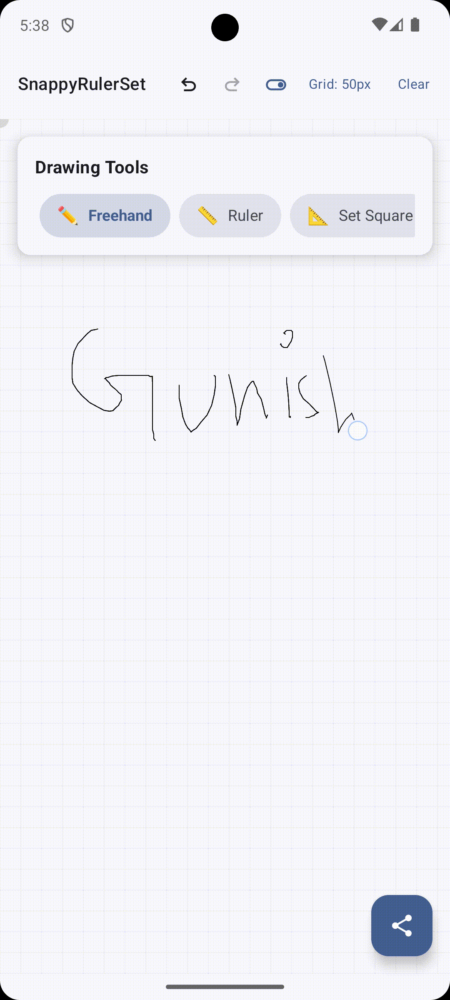

# SnappyRulerSet

SnappyRulerSet is an Android drawing application focused on precise and intuitive geometric constructions. It includes core virtual geometry tools such as a draggable, rotatable ruler with snapping to common angles and existing line points; set squares with 45° and 30°–60° variants; a protractor that measures and snaps angles with high accuracy; and optionally a compass for drawing arcs and circles.

The app is implemented using **Kotlin and Jetpack Compose**, with modular architecture separating rendering, interaction, and data persistence layers. Snapping behavior adapts dynamically with zoom level and prioritizes nearest snap targets with clear visual cues. The app is **offline-first**, requiring no network connectivity.


> **Note:** [Thought Process and Journey for the project](https://docs.google.com/document/d/1teMZuxwTR-Xr0H8pyQ_Xm7WwEowOqEnmHmjIxG5T3Uo/edit?usp=sharing)

## Table of Contents

- [Major Highlights](#major-highlights)
- [Features Implemented](#features-implemented)
- [Documentation References](#documentation-references)
- [Core Components](#core-components)
- [How to Run the Project](#how-to-run-the-project)
- [Complete Project Structure](#complete-project-structure)
- [Working Demo](#working-demo)

## Major Highlights

- MVVM Architecture
- Offline First
- Kotlin
- Flows
- Stateflow
- Compose UI

## Features Implemented

- Grid Snap Toggle - On/Off
- Common Angle Snapping 
- Free Hand Drawing
- Compass Tool
- Protractor Tool
- Set Square Tool
- Export PNG/JPG
- Grid Resizing
- Undo and Redo Support
- Precision Hud for selected Tool
  
## Documentation References

- [Jetpack Compose Graphics Overview](https://developer.android.com/develop/ui/compose/graphics/draw/overview)
- [Drawing Shapes](https://developer.android.com/develop/ui/compose/graphics/draw/shapes)
- [Graphic Modifiers](https://developer.android.com/develop/ui/compose/graphics/draw/modifiers)
- [Multi Touch Input](https://developer.android.com/develop/ui/compose/touch-input/pointer-input/multi-touch)
- [Intrinsic Measurements](https://developer.android.com/develop/ui/compose/layouts/intrinsic-measurements)
- [Dragging, Touch Inputs](https://developer.android.com/develop/ui/compose/touch-input/pointer-input/drag-swipe-fling)

## Core Components

### 1. DrawingCanvas (UI Layer)
**Location**: `ui/DrawingCanvas.kt`

The main composable that handles all drawing operations and user interactions.

```kotlin
@Composable
fun DrawingCanvas(
    state: DrawingState,           // Current drawing state
    snapEngine: SnapEngine,        // Magnetic snapping engine
    onAction: (DrawingAction) -> Unit, // Action dispatcher
    modifier: Modifier = Modifier
)
```

**Key Responsibilities:**
- Handle touch gestures (tap, drag)
- Render all drawing elements
- Manage tool-specific interactions
- Coordinate with SnapEngine for magnetic snapping

### 2. DrawingState (Model Layer)
**Location**: `data/DrawingState.kt`

Centralized state that holds all drawing information.

```kotlin
data class DrawingState(
    val currentTool: DrawingTool = DrawingTool.Freehand,
    val elements: List<DrawingElement> = emptyList(),
    val isDrawing: Boolean = false,
    val canvasOffset: Offset = Offset.Zero,
    val canvasScale: Float = 1f,
    val strokeColor: Color = Color.Black,
    val strokeWidth: Float = 2f,
    val snapEnabled: Boolean = true,
    val rulerTool: RulerTool = RulerTool(),
    val compassTool: CompassTool = CompassTool(),
    val protractorTool: ProtractorTool = ProtractorTool(),
    val setSquareTool: SetSquareTool = SetSquareTool(),
    val gridSpacing: Float = 20f
)
```

### 3. DrawingViewModel (ViewModel Layer)
**Location**: `viewmodel/DrawingViewModel.kt`

Manages state changes and business logic.

```kotlin
class DrawingViewModel : ViewModel() {
    private val _drawingState = mutableStateOf(DrawingState())
    val drawingState: State<DrawingState> = _drawingState
    
    fun handleAction(action: DrawingAction) {
        // Process actions and update state
    }
}
```

## How to Run the Project

1. **Clone the Repository:**
   ```bash
   git clone https://github.com/gunishjain/SnappyRulerSet.git
   cd SnappyRulerSet
   ```

2. **Check AGP Version:** Make sure to check AGP Version to avoid compose compiler sync issues. This project uses AGP version 8.9.1.

3. **Build and run the Project:**
   ```bash
   ./gradlew assembleDebug
   ```

## Complete Project Structure

```
SnappyRulerSet/
├── app/
│   ├── src/main/java/com/gunishjain/myapplication/
│   │   ├── data/                          
│   │   │   ├── DrawingState.kt          
│   │   │   └── UndoRedoManager.kt        
│   │   ├── drawing/                      
│   │   │   ├── tool/                     
│   │   │   │   ├── CompassTool.kt        
│   │   │   │   ├── ProtractorTool.kt     
│   │   │   │   ├── RulerTool.kt          
│   │   │   │   └── SetSquareTool.kt      
│   │   │   ├── PrecisionHUD.kt           
│   │   │   └── SnapEngine.kt             
│   │   ├── export/                        
│   │   │   ├── BitmapExporter.kt         
│   │   │   └── ImageExporter.kt          
│   │   ├── model/                         
│   │   │   ├── DrawingTool.kt            
│   │   │   ├── GeometryTypes.kt          
│   │   │   └── SnapTarget.kt             
│   │   ├── ui/                           
│   │   │   ├── theme/                   
│   │   │   │   ├── Color.kt             
│   │   │   │   ├── Theme.kt              
│   │   │   │   └── Type.kt               
│   │   │   ├── DrawingCanvas.kt          
│   │   │   ├── ExportDialog.kt           
│   │   │   └── ToolOverlay.kt            
│   │   ├── utils/                        
│   │   │   ├── HapticFeedbackUtil.kt     
│   │   │   └── PermissionHandler.kt      
│   │   ├── viewmodel/                    
│   │   │   └── DrawingViewModel.kt       
│   │   └── MainActivity.kt               

```

## Working Demo

| Demo 1 | Demo 2 |
|--------|--------|
|  |  |
